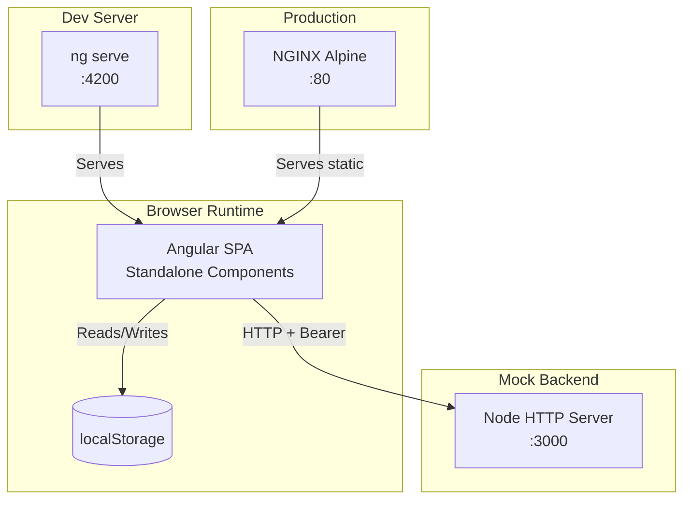
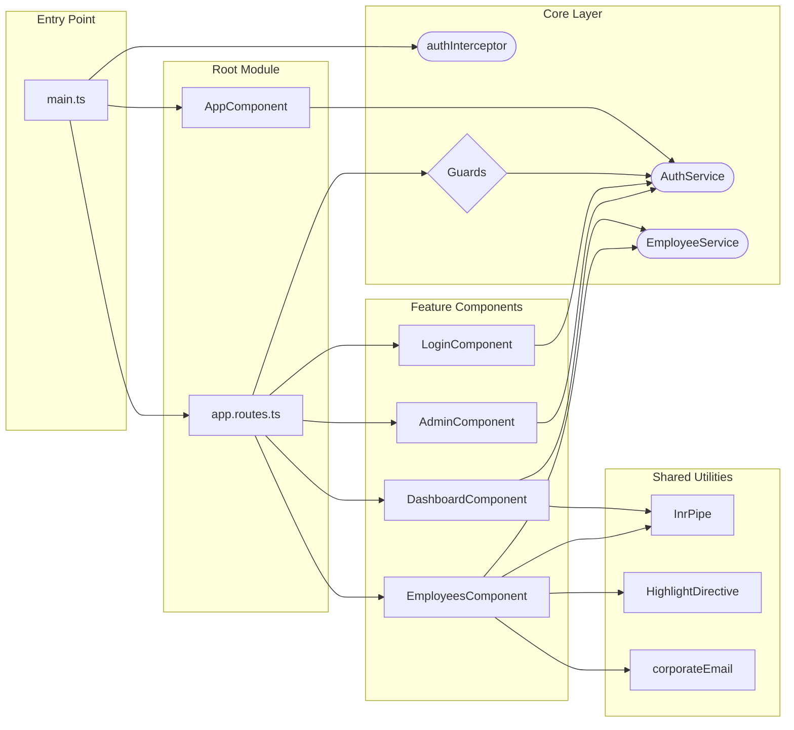
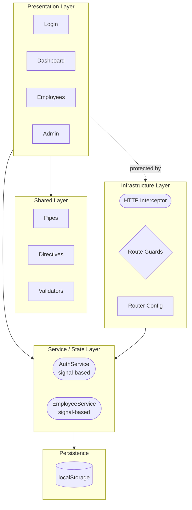

# Architecture Overview

[← Back to Index](./README.md) | [Authentication Flow →](./authentication-flow.md)

---

## High-Level System Architecture

---

## Module Dependency Graph

---

## Layered Architecture

---

## Key Architectural Decisions

| Decision | Choice | Rationale |
|----------|--------|-----------|
| Component model | Standalone components | Tree-shakeable, no NgModule boilerplate |
| State management | Angular Signals | Fine-grained reactivity, no external library |
| Lazy loading | Dynamic `import()` in routes | Smaller initial bundle |
| Persistence | `localStorage` | Zero-backend demo; swap with HTTP trivially |
| Auth transport | HTTP Interceptor + Bearer | Centralized token injection |
| Forms | Reactive Forms | Type-safe, testable |
| Styling | Plain CSS | Minimal; no framework overhead |
| Testing | Vitest | Fast, ESM-native test runner |
| Linting | oxlint | Rust-based, extremely fast |

---

## File Responsibility Map

| File | Layer | Responsibility | Links |
|------|-------|---------------|-------|
| `main.ts` | Entry | Bootstrap, register providers | [Service Layer](./service-layer.md#bootstrap) |
| `app.component.ts` | Presentation | Shell layout, nav | [Component Workflow](./component-workflow.md#app-shell) |
| `app.routes.ts` | Infrastructure | Route config | [Routing](./routing.md#route-table) |
| `models.ts` | Domain | TypeScript interfaces | [Service Layer](./service-layer.md#models) |
| `auth.service.ts` | Core | Auth state | [Authentication Flow](./authentication-flow.md#auth-service) |
| `employee.service.ts` | Core | Employee CRUD | [Service Layer](./service-layer.md#employee-service) |
| `auth.interceptor.ts` | Infrastructure | Token injection | [Authentication Flow](./authentication-flow.md#interceptor) |
| `guards.ts` | Infrastructure | Route protection | [Routing](./routing.md#guards) |
| `login.component.ts` | Feature | Login UI | [Authentication Flow](./authentication-flow.md#login-component) |
| `dashboard.component.ts` | Feature | Stats overview | [Component Workflow](./component-workflow.md#dashboard) |
| `employees.component.ts` | Feature | CRUD table + form | [Component Workflow](./component-workflow.md#employees) |
| `admin.component.ts` | Feature | Admin panel | [Component Workflow](./component-workflow.md#admin) |
| `currency-inr.pipe.ts` | Shared | INR formatting | [Shared Utilities](./shared-utilities.md#inr-pipe) |
| `highlight.directive.ts` | Shared | Row hover effect | [Shared Utilities](./shared-utilities.md#highlight-directive) |
| `validators.ts` | Shared | Custom form validators | [Shared Utilities](./shared-utilities.md#validators) |

---

[← Back to Index](./README.md) | [Authentication Flow →](./authentication-flow.md)
