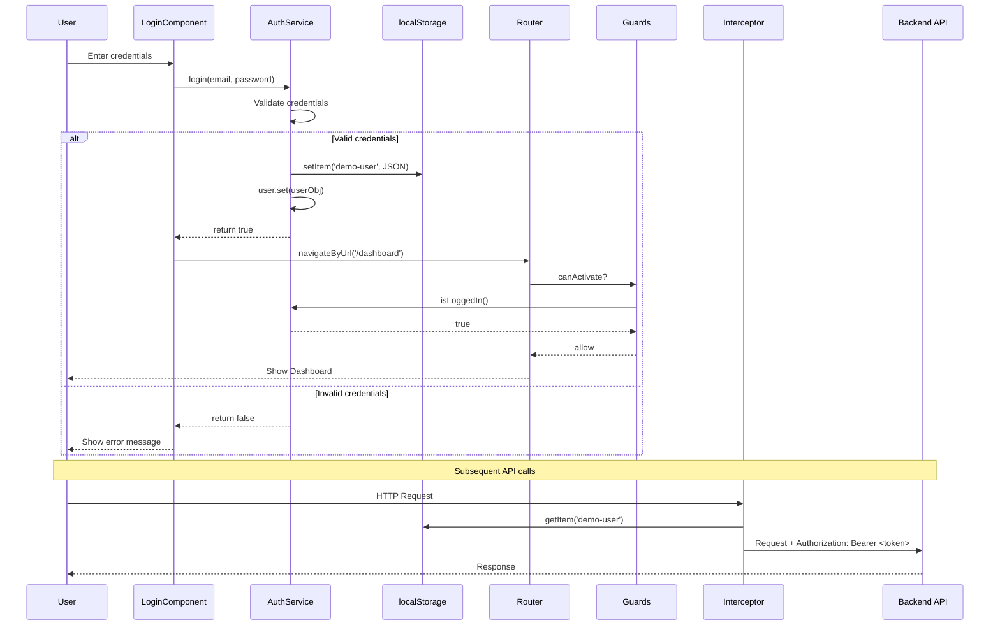
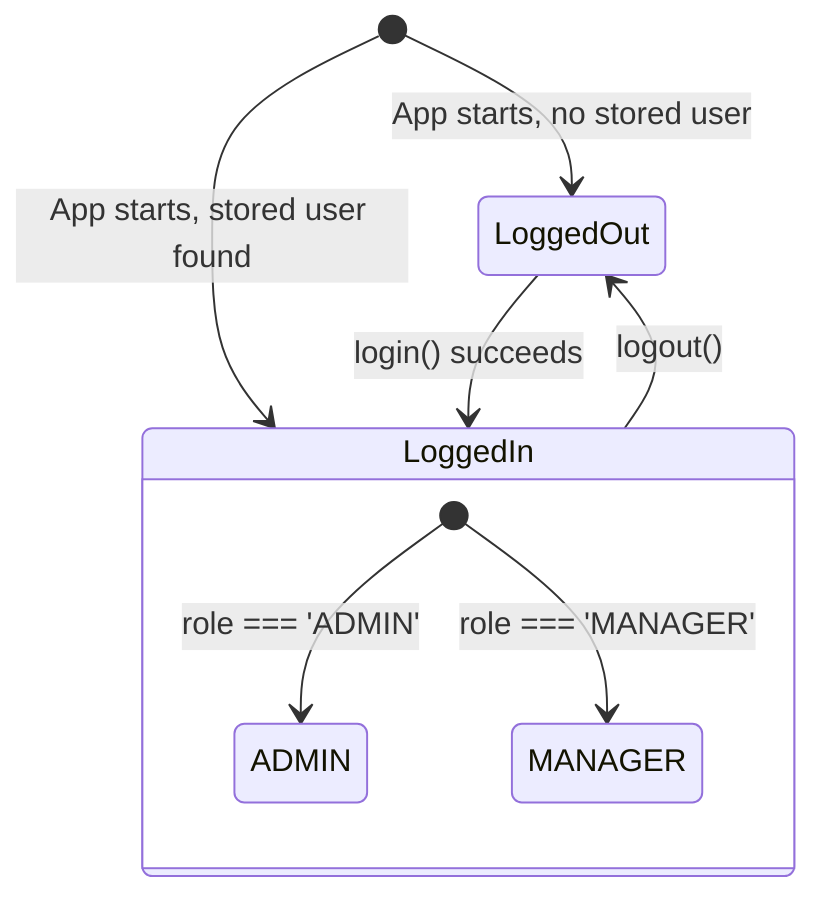
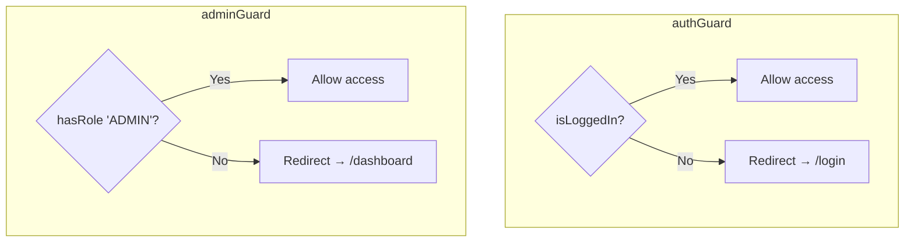
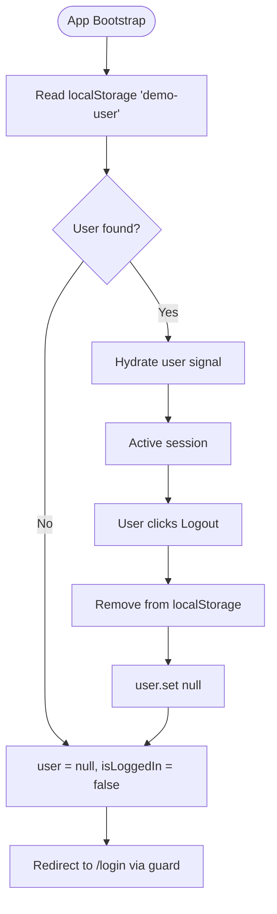

# Authentication Flow

[← Architecture](./architecture.md) | [Back to Index](./README.md) | [Component Workflow →](./component-workflow.md)

---

## Overview

The application uses a **signal-based authentication system** with `localStorage` persistence, HTTP interceptor for token injection, and functional route guards for access control.

---

## End-to-End Authentication Sequence



---

## Login Flow Detail

```mermaid
flowchart TD
    START([User visits /login]) --> FORM[Display login form]
    FORM --> INPUT[User enters email + password]
    INPUT --> CLICK[Click Login button]
    CLICK --> VALIDATE{Credentials match?}
    
    VALIDATE -->|admin@example.com / admin123| ADMIN[Role = ADMIN]
    VALIDATE -->|manager@example.com / manager123| MANAGER[Role = MANAGER]
    VALIDATE -->|No match| ERROR[Show 'Invalid credentials']
    ERROR --> FORM
    
    ADMIN --> PERSIST[Store user in localStorage]
    MANAGER --> PERSIST
    PERSIST --> SIGNAL[Update user signal]
    SIGNAL --> NAV[Navigate to /dashboard]
    NAV --> DONE([Dashboard renders])
```

---

## <a id="auth-service"></a>AuthService — State Machine



### API Surface

| Method | Signature | Description |
|--------|-----------|-------------|
| `user` | `Signal<User \| null>` | Reactive current user state |
| `isLoggedIn` | `Computed<boolean>` | Derived login status |
| `login` | `(email, password) → boolean` | Authenticate and persist |
| `logout` | `() → void` | Clear session |
| `hasRole` | `(role) → boolean` | Role check (ADMIN has all) |

**Source:** [`src/app/core/auth.service.ts`](../src/app/core/auth.service.ts)

---

## <a id="interceptor"></a>HTTP Interceptor

```mermaid
flowchart LR
    REQ[Outgoing HTTP Request] --> CHECK{Token in localStorage?}
    CHECK -->|Yes| CLONE[Clone request<br/>Add Authorization header]
    CHECK -->|No| PASS[Pass through unchanged]
    CLONE --> NEXT[next(clonedReq)]
    PASS --> NEXT2[next(originalReq)]
```

The interceptor reads the raw JSON from `localStorage` and encodes it as a Base64 Bearer token:

```
Authorization: Bearer <base64(user-json)>
```

**Source:** [`src/app/core/auth.interceptor.ts`](../src/app/core/auth.interceptor.ts)

---

## <a id="guards"></a>Route Guards



| Guard | Protects | Behavior |
|-------|----------|----------|
| `authGuard` | `/dashboard`, `/employees`, `/admin` | Redirects unauthenticated users to `/login` |
| `adminGuard` | `/admin` | Redirects non-admin users to `/dashboard` |

**Source:** [`src/app/core/guards.ts`](../src/app/core/guards.ts)

---

## <a id="login-component"></a>LoginComponent

| Property | Type | Purpose |
|----------|------|---------|
| `email` | `string` | Two-way bound input |
| `password` | `string` | Two-way bound input |
| `error` | `string` | Validation error display |

**Template features:**
- `FormsModule` with `[(ngModel)]` for simple form binding
- Conditional error display via `@if (error)`
- Calls `AuthService.login()` and navigates on success

**Source:** [`src/app/features/login.component.ts`](../src/app/features/login.component.ts)

---

## Session Lifecycle



---

## Credential Reference (Demo)

| Email | Password | Role | Access |
|-------|----------|------|--------|
| `admin@example.com` | `admin123` | ADMIN | All routes |
| `manager@example.com` | `manager123` | MANAGER | Dashboard + Employees |

---

[← Architecture](./architecture.md) | [Back to Index](./README.md) | [Component Workflow →](./component-workflow.md)
