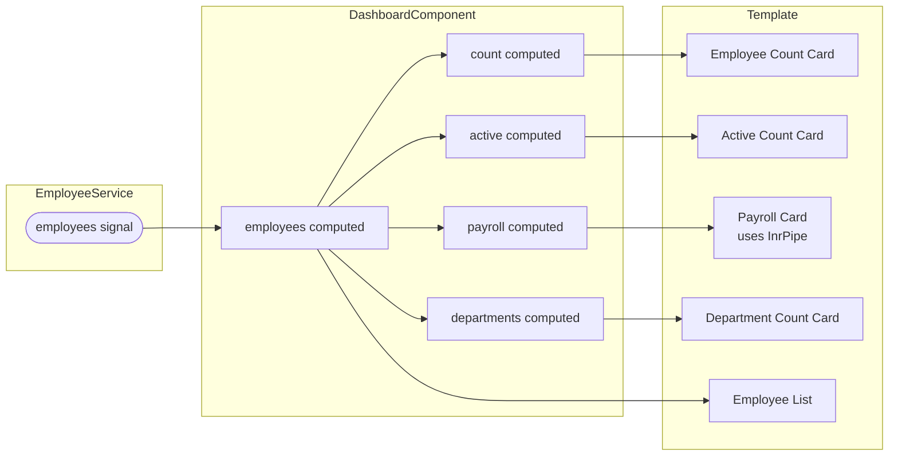
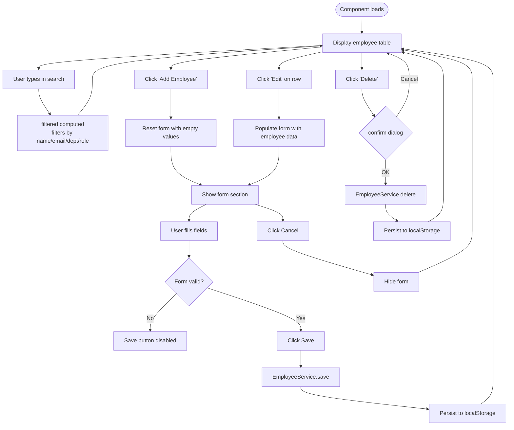
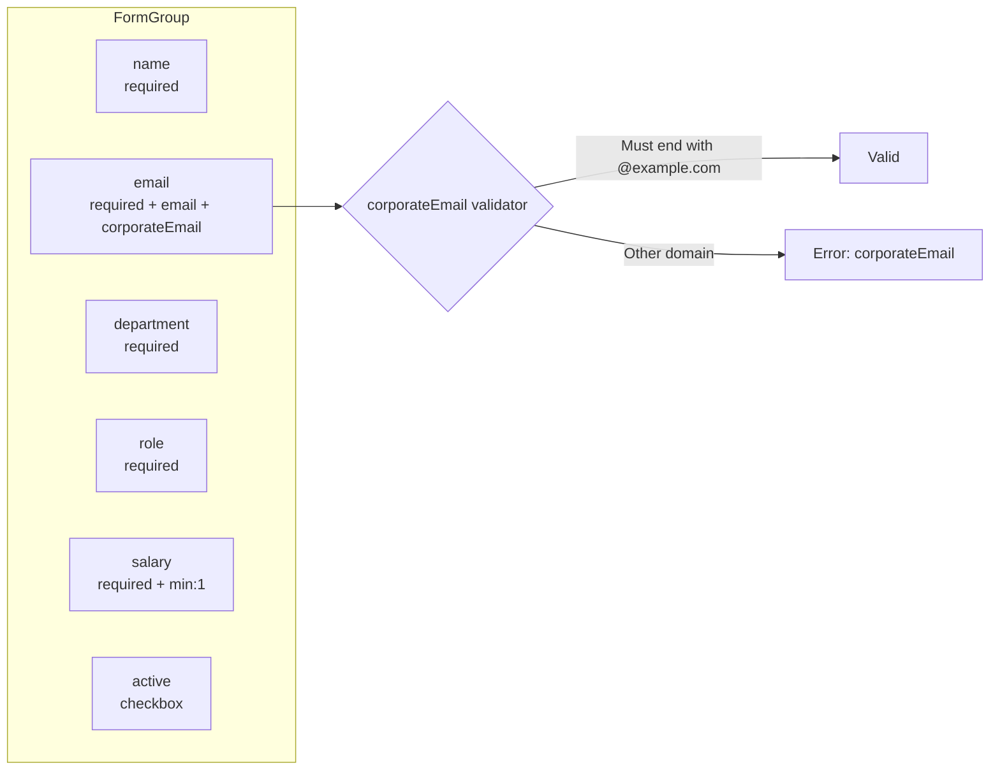
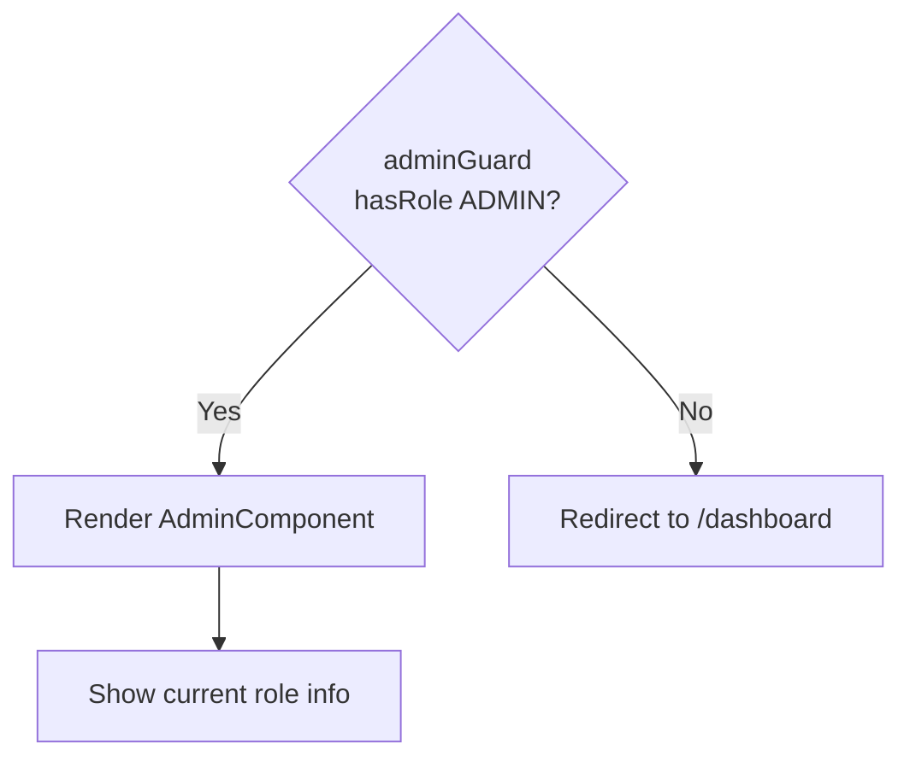
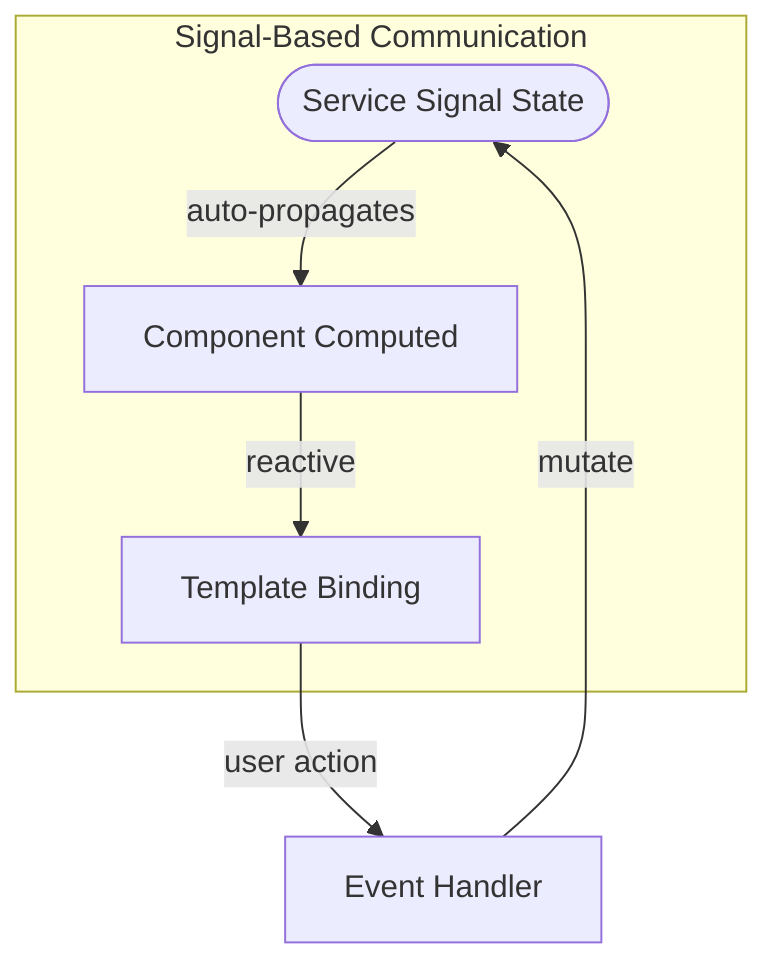

# Component Workflow

[← Authentication Flow](./authentication-flow.md) | [Back to Index](./README.md) | [Service Layer →](./service-layer.md)

---

## <a id="app-shell"></a>AppComponent — Application Shell

```mermaid
flowchart TD
    subgraph AppComponent["AppComponent (Root Shell)"]
        HEADER[Header with Brand Link]
        NAV{isLoggedIn?}
        NAV -->|Yes| LINKS[Dashboard | Employees links]
        NAV -->|No| HIDDEN[Nav hidden]
        LINKS --> ROLE{hasRole 'ADMIN'?}
        ROLE -->|Yes| ADMIN_LINK[Admin link]
        ROLE -->|No| NO_ADMIN[Admin link hidden]
        LOGOUT_BTN[Logout Button]
        MAIN["<main><router-outlet /></main>"]
    end
```

**Responsibilities:**
- Renders navigation conditionally based on auth state
- Shows/hides Admin link based on role
- Provides `<router-outlet>` for feature components

**Source:** [`src/app/app.component.ts`](../src/app/app.component.ts)

---

## <a id="dashboard"></a>DashboardComponent

### Data Flow



### Computed Properties

| Property | Formula | Output |
|----------|---------|--------|
| `count` | `employees().length` | Total headcount |
| `active` | `filter(e.active).length` | Active employees |
| `payroll` | `reduce(sum of salary)` | Total salary (INR) |
| `departments` | `new Set(department).size` | Unique dept count |

**Source:** [`src/app/features/dashboard.component.ts`](../src/app/features/dashboard.component.ts)

---

## <a id="employees"></a>EmployeesComponent — CRUD Workflow

### Complete Interaction Flow



### Form Validation Rules



| Field | Validators | Link |
|-------|-----------|------|
| `name` | `Validators.required` | — |
| `email` | `required`, `email`, [`corporateEmail`](./shared-utilities.md#validators) | Custom validator |
| `department` | `Validators.required` | — |
| `role` | `Validators.required` | — |
| `salary` | `required`, `min(1)` | — |
| `active` | none | Toggle |

### Signal State

| Signal | Type | Purpose |
|--------|------|---------|
| `query` | `WritableSignal<string>` | Search filter text |
| `editing` | `WritableSignal<Employee \| null>` | Current edit target |
| `filtered` | `Computed<Employee[]>` | Derived filtered list |
| `employees` | `Computed<Employee[]>` | From service |

**Source:** [`src/app/features/employees.component.ts`](../src/app/features/employees.component.ts)

---

## <a id="admin"></a>AdminComponent



**Simple read-only panel** that displays the current user's role. Protected by both `authGuard` and `adminGuard`.

**Source:** [`src/app/features/admin.component.ts`](../src/app/features/admin.component.ts)

---

## Component Communication Pattern



All components follow the same pattern:
1. **Inject** service
2. **Expose** service signals or computed derivatives
3. **Template** reads signals reactively
4. **Event handlers** call service methods to mutate state
5. **Signal propagation** automatically updates the view

---

## Component Import Matrix

| Component | ReactiveFormsModule | FormsModule | InrPipe | HighlightDirective | RouterLink |
|-----------|:---:|:---:|:---:|:---:|:---:|
| AppComponent | | | | | ✓ |
| LoginComponent | | ✓ | | | |
| DashboardComponent | | | ✓ | | |
| EmployeesComponent | ✓ | | ✓ | ✓ | |
| AdminComponent | | | | | |

---

[← Authentication Flow](./authentication-flow.md) | [Back to Index](./README.md) | [Service Layer →](./service-layer.md)
