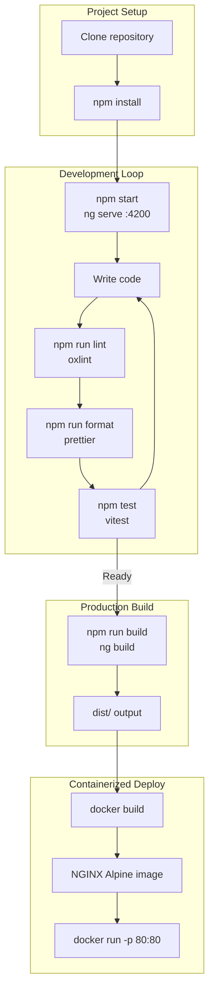
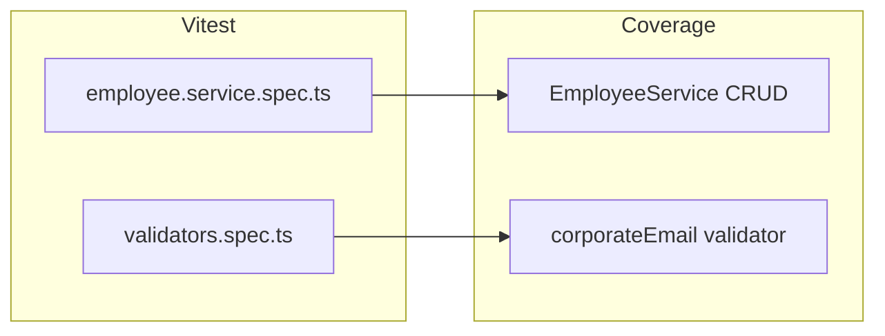
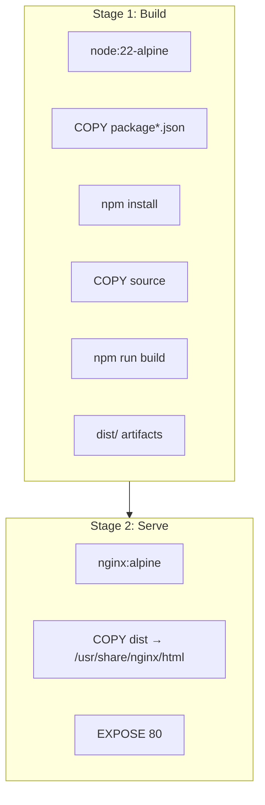
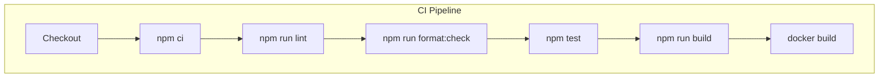
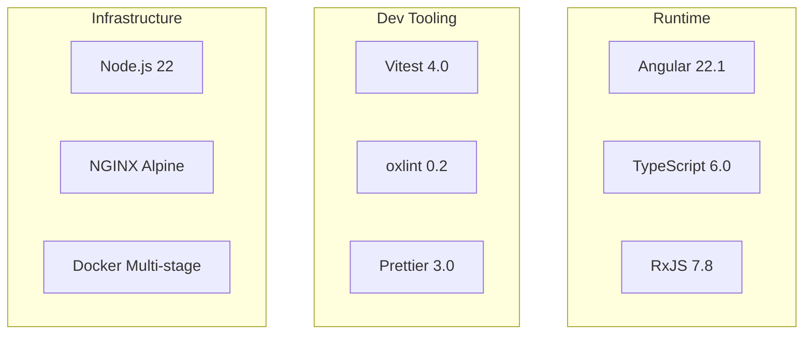
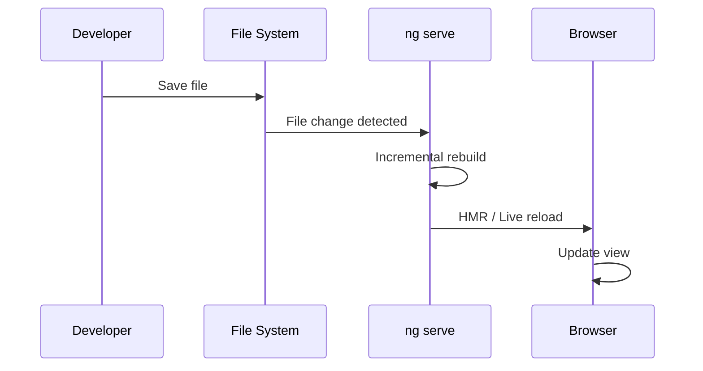

# Development Workflow

[← Shared Utilities](./shared-utilities.md) | [Back to Index](./README.md)

---

## Development Lifecycle



---

## NPM Scripts

| Script | Command | Purpose | Link |
|--------|---------|---------|------|
| `start` | `ng serve` | Dev server with HMR at `:4200` | — |
| `build` | `ng build` | Production AOT build | [Docker Build](#docker-build) |
| `test` | `ng test --watch=false` | Single-run unit tests (Vitest) | [Testing](#testing) |
| `format` | `prettier --write "src/**/*.{ts,html,css,json}"` | Auto-format source | [Formatting](#formatting) |
| `format:check` | `prettier --check ...` | CI format verification | [CI Pipeline](#ci-pipeline) |
| `lint` | `oxlint` | Fast Rust-based linter | [Linting](#linting) |
| `lint:fix` | `oxlint --fix` | Auto-fix lint issues | — |

---

## <a id="testing"></a>Testing



### Running Tests

```bash
npm test                    # Single run
npx vitest --watch          # Watch mode
npx vitest --coverage       # With coverage report
```

### Test Files

| Spec File | Tests | Source |
|-----------|-------|--------|
| `employee.service.spec.ts` | CRUD operations, signal state | [`src/app/core/employee.service.spec.ts`](../src/app/core/employee.service.spec.ts) |
| `validators.spec.ts` | corporateEmail validation | [`src/app/shared/validators.spec.ts`](../src/app/shared/validators.spec.ts) |

---

## <a id="linting"></a>Linting

Uses **oxlint** — a Rust-based linter that's orders of magnitude faster than ESLint.

```bash
npm run lint          # Check for issues
npm run lint:fix      # Auto-fix
```

Configuration: [`oxlint.json`](../oxlint.json)

---

## <a id="formatting"></a>Formatting

Uses **Prettier** for consistent code style:

```bash
npm run format        # Format all files
npm run format:check  # Check without modifying (CI)
```

Covers: `*.ts`, `*.html`, `*.css`, `*.json` in `src/`

---

## <a id="docker-build"></a>Docker Build



### Build & Run

```bash
docker build -t emp-portal .
docker run -p 8080:80 emp-portal
# Access at http://localhost:8080
```

**Source:** [`Dockerfile`](../Dockerfile)

---

## <a id="ci-pipeline"></a>CI Pipeline (Recommended)



| Step | Command | Fails if |
|------|---------|----------|
| Install | `npm ci` | Lock file mismatch |
| Lint | `npm run lint` | Any lint error |
| Format | `npm run format:check` | Unformatted files |
| Test | `npm test` | Test failures |
| Build | `npm run build` | Compilation errors |
| Docker | `docker build .` | Build failure |

---

## Mock Backend

A minimal Node.js HTTP server for development:

```bash
node mock-backend/server.js
# Listening at http://localhost:3000
```

### Endpoints

| Method | URL | Response |
|--------|-----|----------|
| `GET` | `/api/employees` | Employee array JSON |
| `OPTIONS` | `*` | CORS preflight (204) |
| Other | `*` | 404 |

**Source:** [`mock-backend/server.js`](../mock-backend/server.js)

---

## Tech Stack Summary



| Category | Tool | Version |
|----------|------|---------|
| Framework | Angular | 22.1 |
| Language | TypeScript | 6.0 |
| Reactivity | RxJS | 7.8 |
| Test Runner | Vitest | 4.0 |
| Linter | oxlint | 0.2 |
| Formatter | Prettier | 3.0 |
| Container | Docker + NGINX | Alpine |

---

## File Watcher Flow (Development)



---

[← Shared Utilities](./shared-utilities.md) | [Back to Index](./README.md)
