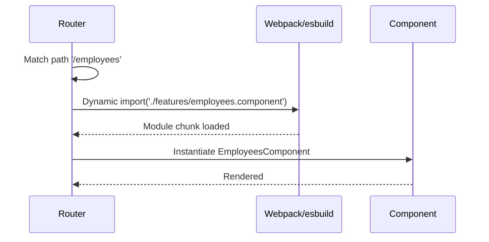
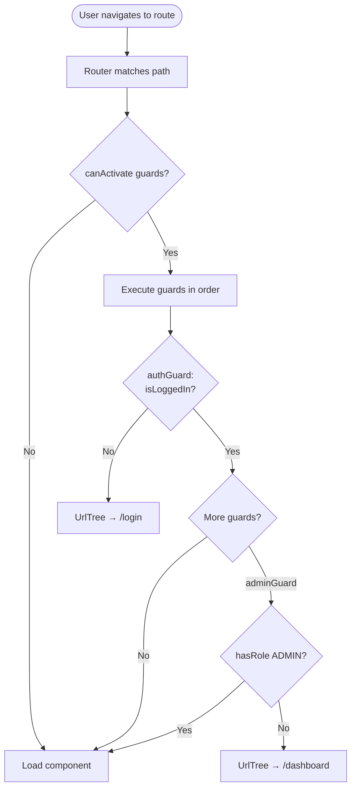
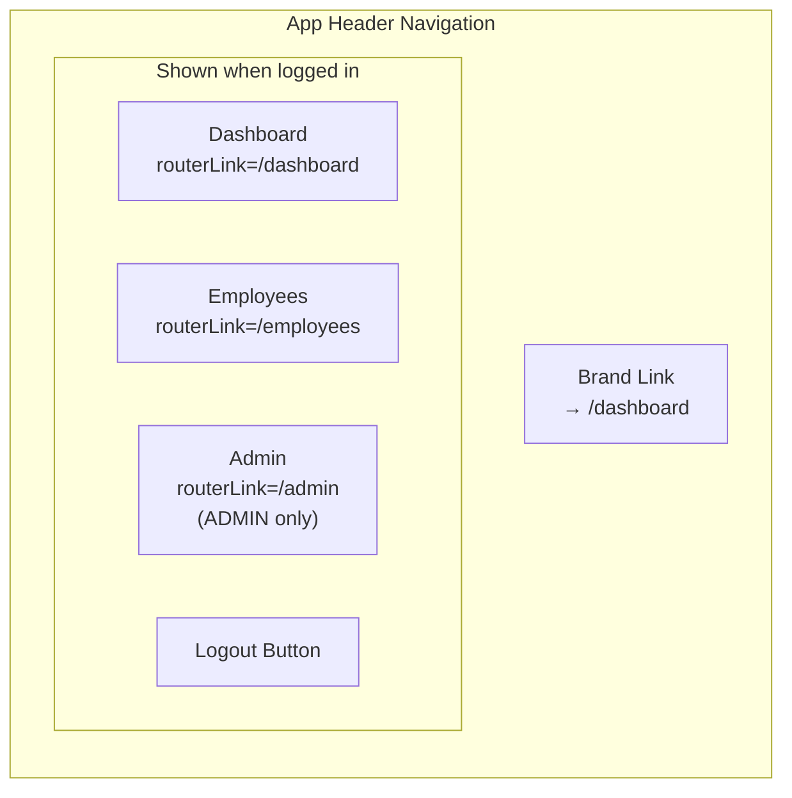
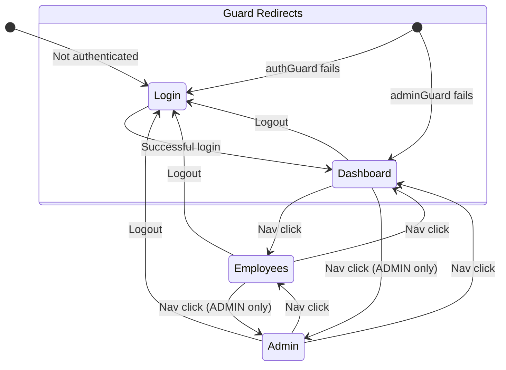
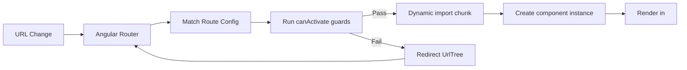

# Routing & Navigation

[← Service Layer](./service-layer.md) | [Back to Index](./README.md) | [Shared Utilities →](./shared-utilities.md)

---

## <a id="route-table"></a>Route Configuration

```mermaid
flowchart TD
    ROOT["/ (root)"] -->|redirectTo| DASH_R[/dashboard]
    WILDCARD["/** (wildcard)"] -->|redirectTo| DASH_R

    subgraph Routes["Defined Routes"]
        LOGIN_R["/login<br/>LoginComponent"]
        DASH_R["/dashboard<br/>DashboardComponent"]
        EMP_R["/employees<br/>EmployeesComponent"]
        ADMIN_R["/admin<br/>AdminComponent"]
    end

    subgraph Guards["Guard Protection"]
        AG{authGuard}
        ADG{adminGuard}
    end

    DASH_R -.->|protected by| AG
    EMP_R -.->|protected by| AG
    ADMIN_R -.->|protected by| AG
    ADMIN_R -.->|protected by| ADG
```

### Route Table

| Path | Component | Guards | Loading |
|------|-----------|--------|---------|
| `/login` | `LoginComponent` | None | Lazy |
| `/dashboard` | `DashboardComponent` | `authGuard` | Lazy |
| `/employees` | `EmployeesComponent` | `authGuard` | Lazy |
| `/admin` | `AdminComponent` | `authGuard`, `adminGuard` | Lazy |
| `/` | — | — | Redirect → `/dashboard` |
| `**` | — | — | Redirect → `/dashboard` |

**Source:** [`src/app/app.routes.ts`](../src/app/app.routes.ts)

---

## Lazy Loading Strategy



All feature components use **dynamic `import()`** for code splitting:

```typescript
loadComponent: () => import('./features/login.component').then(m => m.LoginComponent)
```

This produces separate chunks per route, reducing the initial bundle size.

---

## <a id="guards"></a>Guard Execution Flow



### Guard Composition

| Route | Guard Chain | Failure Redirect |
|-------|------------|------------------|
| `/dashboard` | `authGuard` | → `/login` |
| `/employees` | `authGuard` | → `/login` |
| `/admin` | `authGuard` → `adminGuard` | → `/login` or → `/dashboard` |

**Source:** [`src/app/core/guards.ts`](../src/app/core/guards.ts)

---

## Navigation UI



The navigation renders conditionally:
- **Not logged in:** Only brand link visible
- **Logged in (USER/MANAGER):** Dashboard + Employees links + Logout
- **Logged in (ADMIN):** All links + Logout

---

## Full Navigation State Diagram



---

## Route-to-Component Resolution



---

[← Service Layer](./service-layer.md) | [Back to Index](./README.md) | [Shared Utilities →](./shared-utilities.md)
