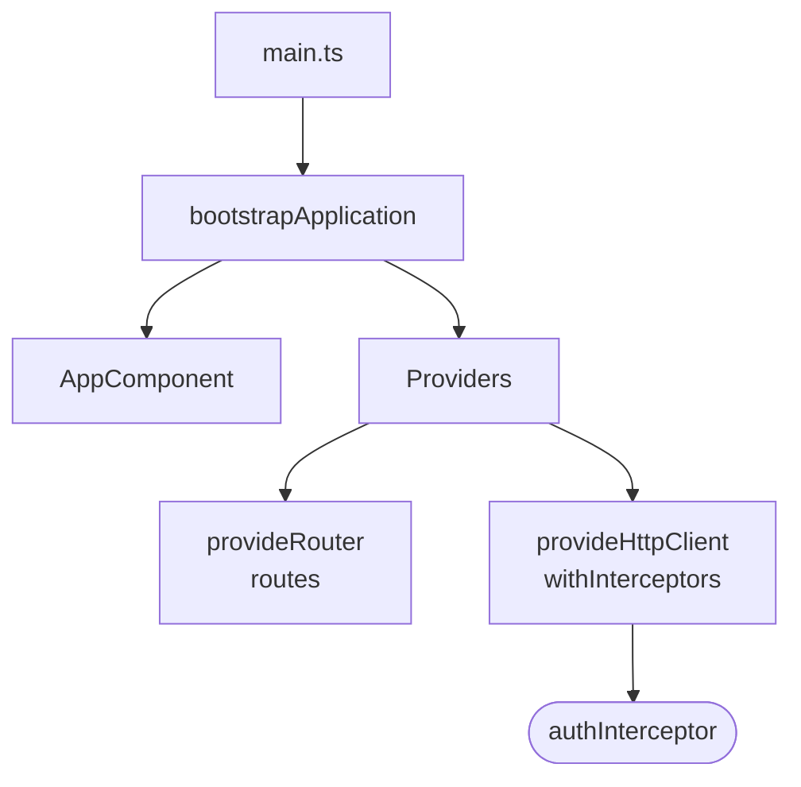
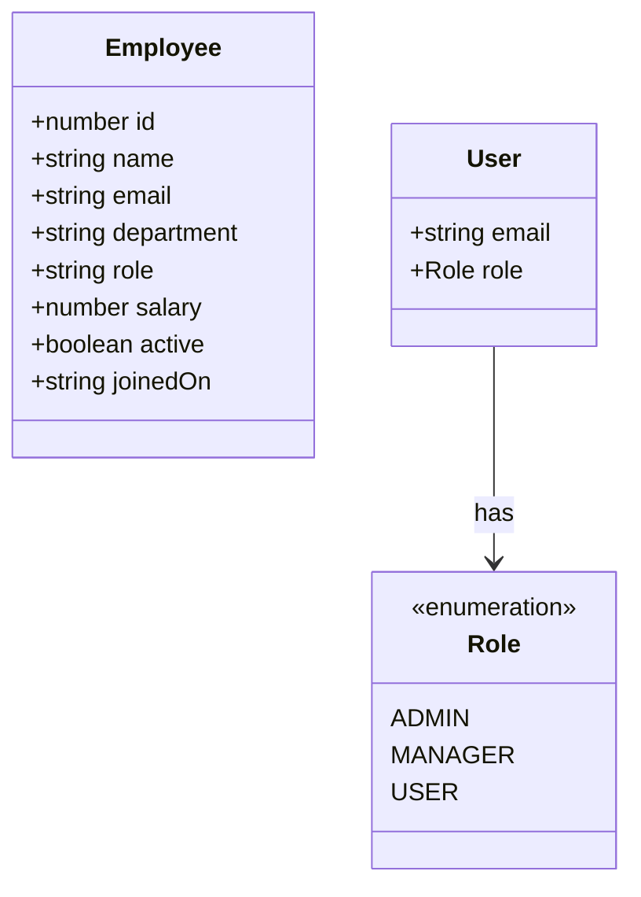
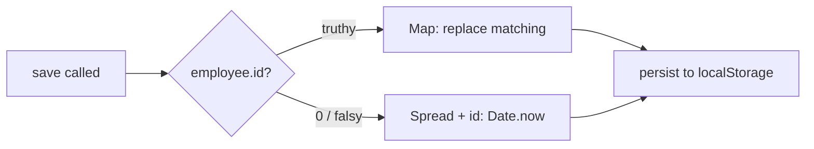
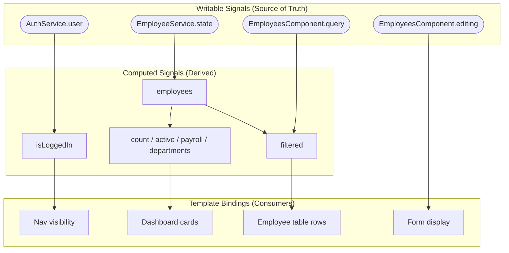
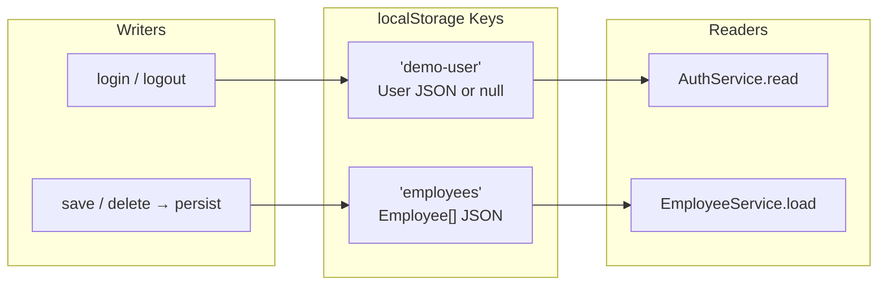

# Service Layer & State Management

[← Component Workflow](./component-workflow.md) | [Back to Index](./README.md) | [Routing →](./routing.md)

---

## <a id="bootstrap"></a>Bootstrap & Provider Registration



Providers registered at bootstrap are application-wide singletons.

**Source:** [`src/main.ts`](../src/main.ts)

---

## <a id="models"></a>Domain Models



**Source:** [`src/app/models.ts`](../src/app/models.ts)

---

## <a id="employee-service"></a>EmployeeService — CRUD State Manager

### State Flow

```mermaid
flowchart TD
    subgraph Initialization
        BOOT([Service created]) --> LOAD[load from localStorage]
        LOAD --> FOUND{Data exists?}
        FOUND -->|Yes| PARSE[Parse JSON → Employee array]
        FOUND -->|No| SEED[Use hardcoded seed data]
        PARSE --> STATE
        SEED --> STATE
    end

    subgraph State["Signal State"]
        STATE([state: WritableSignal&lt;Employee[]&gt;])
        EMPLOYEES[employees: Computed&lt;Employee[]&gt;]
        STATE --> EMPLOYEES
    end

    subgraph Operations
        LIST_OP[list] --> STATE
        GET_OP[get id] --> STATE
        SAVE_OP[save employee] --> UPDATE[state.update]
        DELETE_OP[delete id] --> FILTER[state.update filter]
    end

    UPDATE --> PERSIST[persist → localStorage]
    FILTER --> PERSIST
```

### API Surface

| Method | Signature | Behavior |
|--------|-----------|----------|
| `employees` | `Computed<Employee[]>` | Reactive read-only list |
| `list()` | `() → Employee[]` | Snapshot of current state |
| `get(id)` | `(number) → Employee \| undefined` | Find by ID |
| `save(e)` | `(Employee) → void` | Create (id=0) or update |
| `delete(id)` | `(number) → void` | Remove by ID |

### Save Logic



**Source:** [`src/app/core/employee.service.ts`](../src/app/core/employee.service.ts)

---

## AuthService — Authentication State

> Detailed in [Authentication Flow → AuthService](./authentication-flow.md#auth-service)

```mermaid
flowchart LR
    subgraph AuthService
        USER([user: Signal&lt;User|null&gt;])
        LOGGED[isLoggedIn: Computed&lt;boolean&gt;]
        USER --> LOGGED
    end

    subgraph Methods
        LOGIN[login email, password]
        LOGOUT[logout]
        HAS_ROLE[hasRole role]
    end

    LOGIN -->|set| USER
    LOGOUT -->|null| USER
    HAS_ROLE -->|read| USER
```

**Source:** [`src/app/core/auth.service.ts`](../src/app/core/auth.service.ts)

---

## Signal Reactivity Model



---

## Persistence Strategy



| Key | Written by | Read by | Format |
|-----|-----------|---------|--------|
| `demo-user` | `AuthService.login/logout` | `AuthService.read`, `authInterceptor` | `User` JSON or absent |
| `employees` | `EmployeeService.persist` | `EmployeeService.load` | `Employee[]` JSON |

---

## Seed Data

The `EmployeeService` ships with 4 hardcoded employees used when no localStorage data exists:

| ID | Name | Department | Salary |
|----|------|-----------|--------|
| 1 | Rambabu Pudi | Engineering | ₹18,00,000 |
| 2 | Priya Reddy | Product | ₹16,00,000 |
| 3 | Vikram Singh | Engineering | ₹14,50,000 |
| 4 | Neha Patel | HR | ₹12,00,000 |

---

[← Component Workflow](./component-workflow.md) | [Back to Index](./README.md) | [Routing →](./routing.md)
