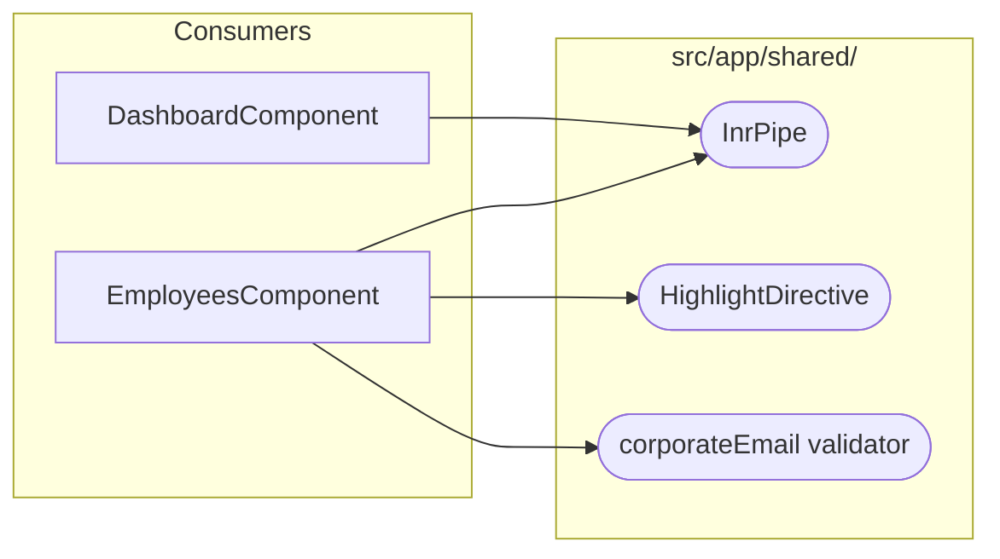
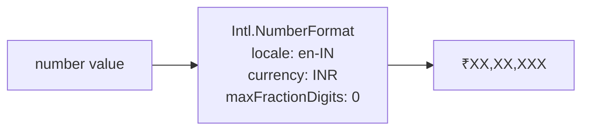
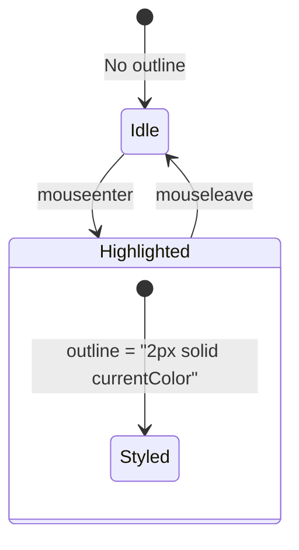
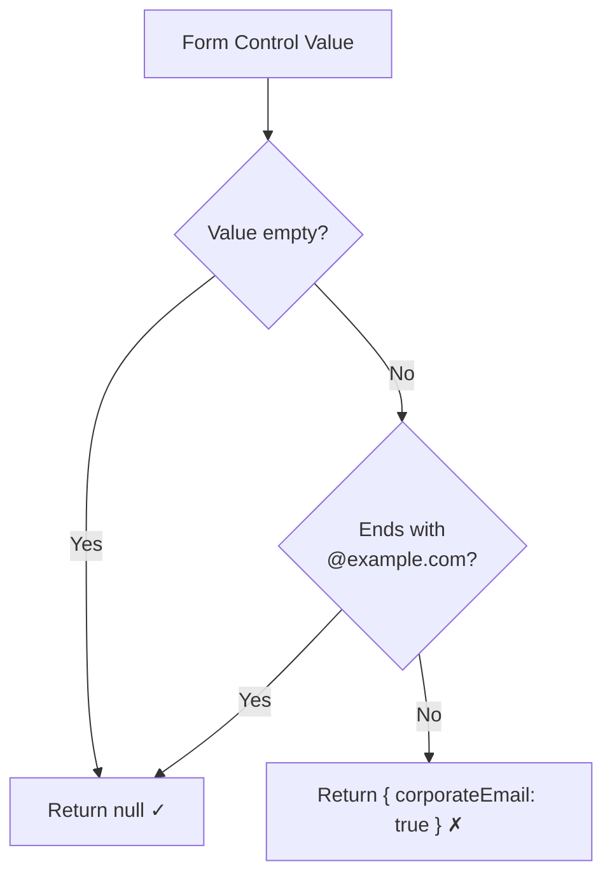
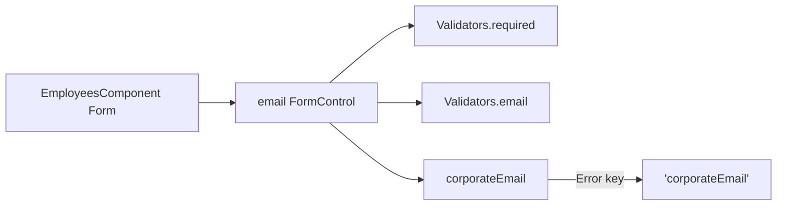

# Shared Utilities

[← Routing](./routing.md) | [Back to Index](./README.md) | [Development Workflow →](./development-workflow.md)

---

## Overview



---

## <a id="inr-pipe"></a>InrPipe — Currency Formatter

### Purpose
Formats a numeric value as Indian Rupees (₹) with the Indian numbering system (lakhs/crores).

### Usage

```html
{{ employee.salary | inr }}
<!-- Output: ₹18,00,000 -->
```

### Implementation



| Parameter | Value |
|-----------|-------|
| Locale | `en-IN` |
| Style | `currency` |
| Currency | `INR` |
| Fraction digits | 0 |

**Used by:** [DashboardComponent](./component-workflow.md#dashboard), [EmployeesComponent](./component-workflow.md#employees)

**Source:** [`src/app/shared/currency-inr.pipe.ts`](../src/app/shared/currency-inr.pipe.ts)

---

## <a id="highlight-directive"></a>HighlightDirective — Row Hover Effect

### Purpose
Adds a visual outline to table rows on mouse hover for better UX.

### Usage

```html
<tr appHighlight>...</tr>
```

### Behavior



| Event | Action |
|-------|--------|
| `mouseenter` | Set `outline: 2px solid currentColor` |
| `mouseleave` | Remove outline |

**Used by:** [EmployeesComponent](./component-workflow.md#employees) (table rows)

**Source:** [`src/app/shared/highlight.directive.ts`](../src/app/shared/highlight.directive.ts)

---

## <a id="validators"></a>Custom Validators

### `corporateEmail`

Validates that an email address ends with `@example.com` (corporate domain restriction).



| Input | Result |
|-------|--------|
| `""` | `null` (valid — let `required` handle empty) |
| `user@example.com` | `null` (valid) |
| `user@gmail.com` | `{ corporateEmail: true }` (invalid) |

### Integration with Forms



**Used by:** [EmployeesComponent](./component-workflow.md#employees) (email field)

**Source:** [`src/app/shared/validators.ts`](../src/app/shared/validators.ts)

---

## Test Coverage

The validators have dedicated spec tests:

**Source:** [`src/app/shared/validators.spec.ts`](../src/app/shared/validators.spec.ts)

---

[← Routing](./routing.md) | [Back to Index](./README.md) | [Development Workflow →](./development-workflow.md)
